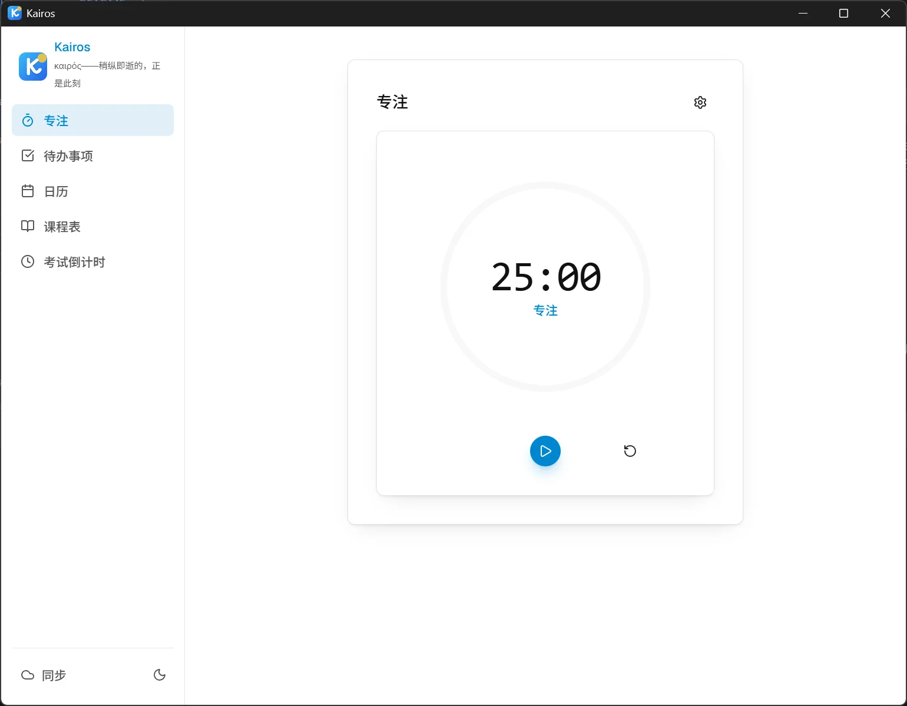
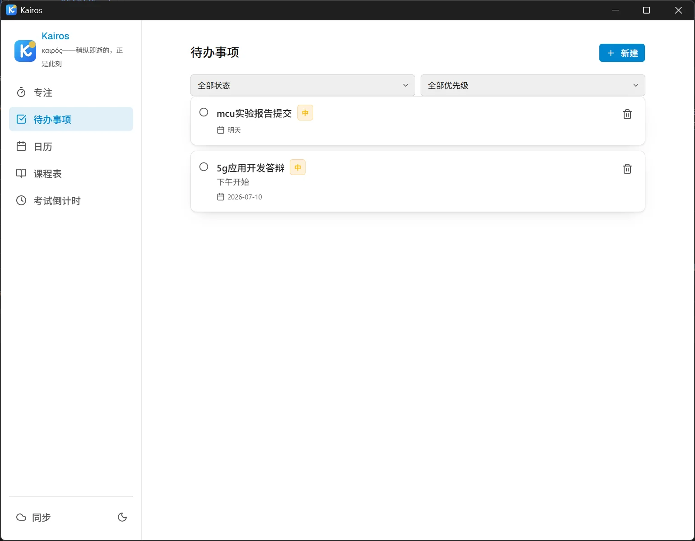
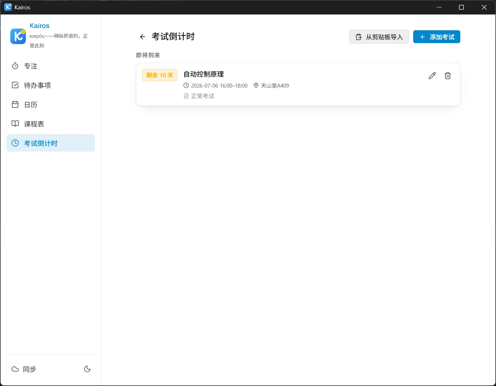
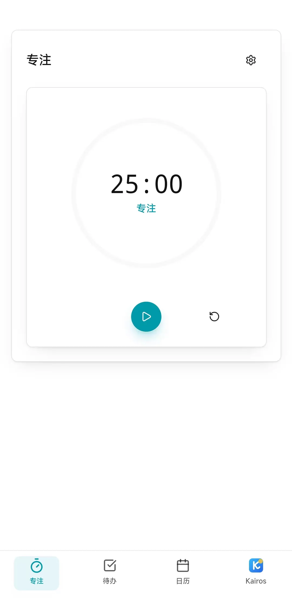
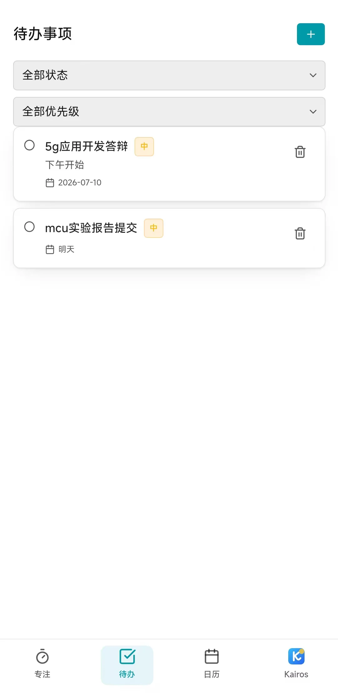
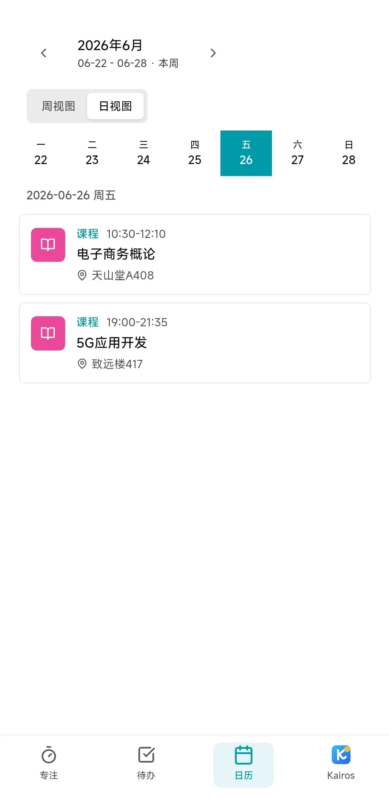
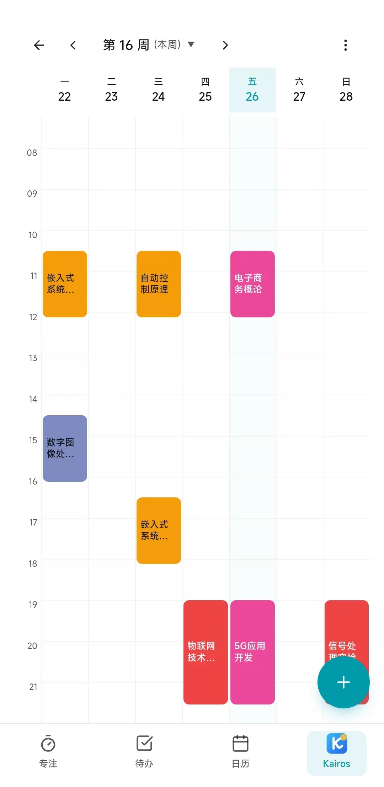

# Kairos

> καιρός——稍纵即逝的，正是此刻

Kairos 是一个面向学生的跨平台学业时间管理应用。它把专注计时、待办事项、课程表、考试倒计时和集成日历放在同一个本地优先的工作台里，帮助用户在合适的时间看到该处理的安排，并进入执行状态。

## 功能概览

| 模块 | 说明 |
|------|------|
| 专注 | 可配置的工作/休息计时器，支持圆环进度和阶段切换 |
| 待办事项 | 支持优先级、状态、截止日期、标签、筛选和排序 |
| 集成日历 | 同时展示课程、考试和有截止日期的待办；默认日视图，支持课程表式周视图 |
| 课程表 | 周视图课程网格，支持周次规则、学期起始日和课程导入 |
| 考试倒计时 | 管理考试时间、地点和备注，显示考试剩余时间 |
| Kairos | 移动端的更多功能入口，集中放置课程表、考试、同步和外观设置 |
| WebDAV 同步 | 通过用户自有 WebDAV 服务同步本地数据 |

## 界面预览

### Windows

<table>
  <tr>
    <td></td>
    <td></td>
  </tr>
  <tr>
    <td></td>
    <td></td>
  </tr>
  <tr>
    <td colspan="2"></td>
  </tr>
</table>

### Android

<table>
  <tr>
    <td></td>
    <td></td>
  </tr>
  <tr>
    <td></td>
    <td></td>
  </tr>
  <tr>
    <td colspan="2"></td>
  </tr>
</table>

## 核心特点

- 本地优先：核心数据保存在本机 SQLite 中，不依赖平台账号或云服务。
- 学生场景优先：课程周次、单双周、考试倒计时、假期周日程和课表导入是一等能力。
- 计划与执行闭环：日历负责汇总安排，专注计时负责进入执行。
- 跨平台：基于 Tauri v2，面向 Windows、Linux 和 Android。
- 离线友好：前端不使用外部 CDN、字体服务、分析或遥测。

## 技术栈

| 层级 | 技术 |
|------|------|
| 应用壳 | Tauri v2 |
| 前端 | React 19、TypeScript、Tailwind CSS v4、shadcn/ui、Fluent UI |
| 图标 | Lucide React |
| 后端 | Rust |
| 数据库 | SQLite / rusqlite |
| 同步 | WebDAV / reqwest |
| 移动端 | Tauri Android |

## 开发环境

### 基础要求

- Node.js 18+
- Rust stable
- Tauri v2 CLI
- Windows 构建需要 WebView2 Runtime
- Linux 构建需要 WebKitGTK 相关依赖
- Android 构建需要 Android SDK、NDK 和已安装的 Rust Android targets

### Linux 依赖示例

Arch Linux:

```bash
sudo pacman -S webkit2gtk-4.1 base-devel
```

### 安装与启动

```bash
npm install
make dev
```

也可以直接使用：

```bash
cargo tauri dev
```

## 常用命令

```bash
make dev                 # 启动桌面端开发环境
make build               # 构建桌面端 release
make check               # Rust + TypeScript 类型检查
make test                # 运行测试
make lint                # Rust clippy + 前端 lint
make audit               # 离线资源检查
make verify              # 完整检查流水线
make android-dev         # 启动 Android 开发模式
make android-build-debug # 构建 Android debug APK
make android-build       # 构建 Android release 包
```

前端资源单独构建：

```bash
npm run build
```

重新生成应用图标：

```bash
npm run icons
```

### Android 开发模式

默认使用 USB/模拟器端口反向代理，Android 端访问 `127.0.0.1:5173`，不依赖局域网 IP：

```bash
npm run android:dev
```

如果使用真机局域网调试，需要显式指定电脑在同一网络下的 IP，并确认防火墙放行 TCP 5173：

```bash
npm run android:dev -- --host 172.20.199.104
```

安装已有 debug APK 到 MuMu 并设置端口反向代理：

```bash
npm run android:install-debug
npm run android:install-debug -- --rebuild
```

## 架构说明

```text
React 前端
  |
  | Tauri invoke / event
  v
Rust 命令层
  |
  v
业务逻辑与数据聚合
  |
  v
SQLite 本地存储
  |
  v
WebDAV 同步
```

业务规则主要位于 `src-tauri/src/`。前端负责渲染、交互和调用 Tauri 命令，尽量不重复后端的业务判断。

## 目录结构

```text
src/                         # React 前端
  components/                # 功能组件
    calendar/                # 集成日历
    kairos/                  # Kairos 功能入口
    pomodoro/                # 专注计时
    todo/                    # 待办事项
    courses/                 # 课程表
    exams/                   # 考试倒计时
    sync/                    # WebDAV 同步
    shared/                  # 共享布局与视觉组件
    ui/                      # shadcn/ui 基础组件
  types/                     # 前端类型定义
  hooks/                     # React hooks
  lib/                       # 工具函数

src-tauri/                   # Tauri / Rust 后端
  src/                       # Rust 命令、数据库和业务逻辑
  icons/                     # 桌面与 Android 图标资源
  gen/android/               # Tauri 生成的 Android 工程
```

## 设计方向

- 主色采用清澈蓝色系，减少原有紫色带来的拥挤感。
- 桌面端保留完整侧边栏入口。
- 移动端底部保留四个主入口：专注、待办、日历、Kairos。
- Kairos 页面承担品牌说明、次级功能入口、同步和外观设置。

## 许可

MIT
