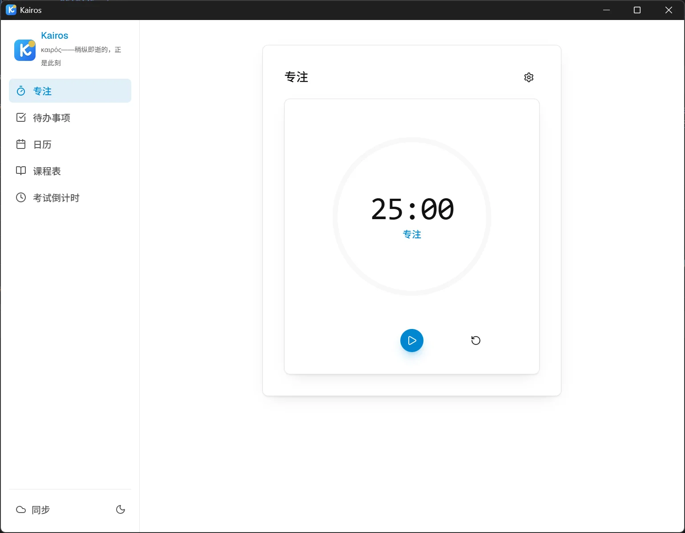
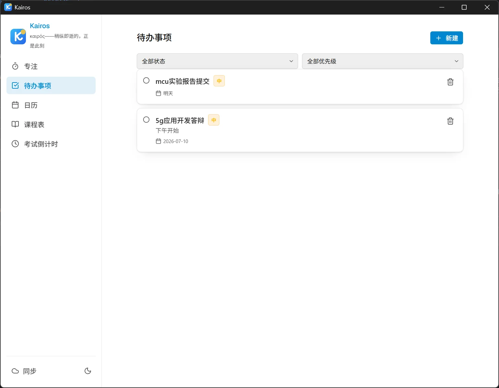
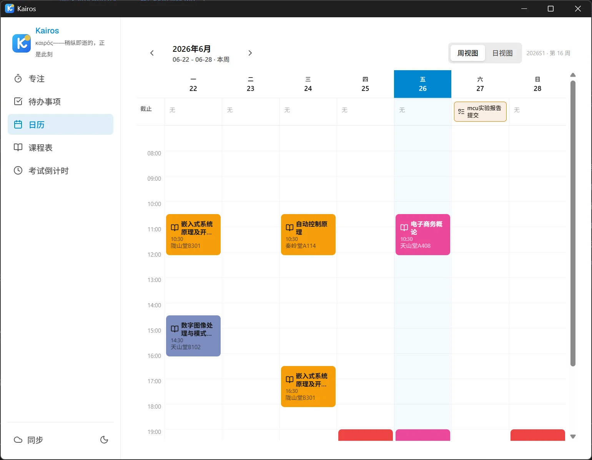
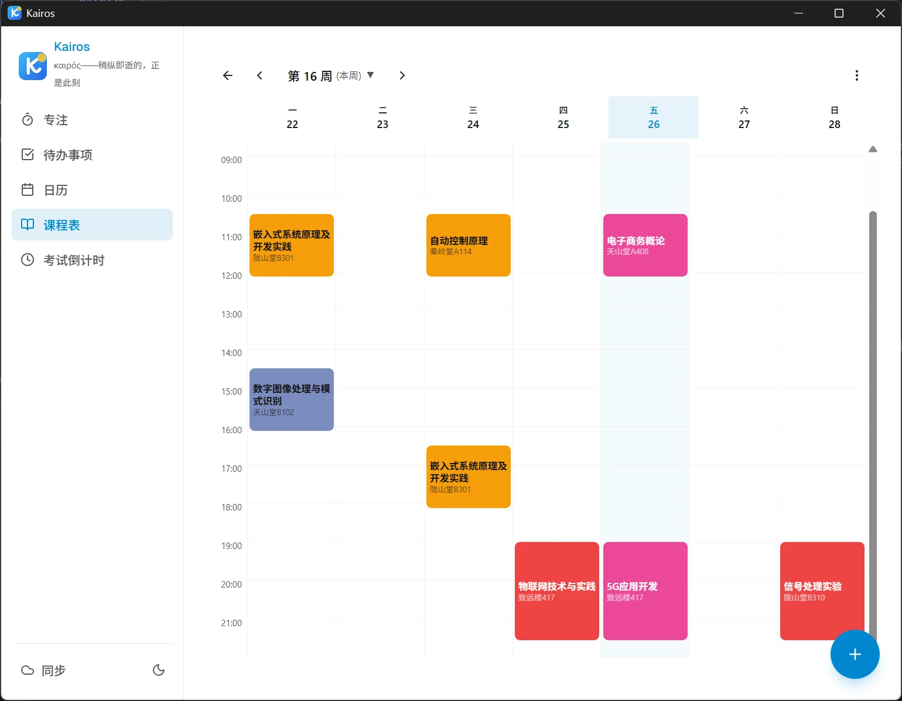
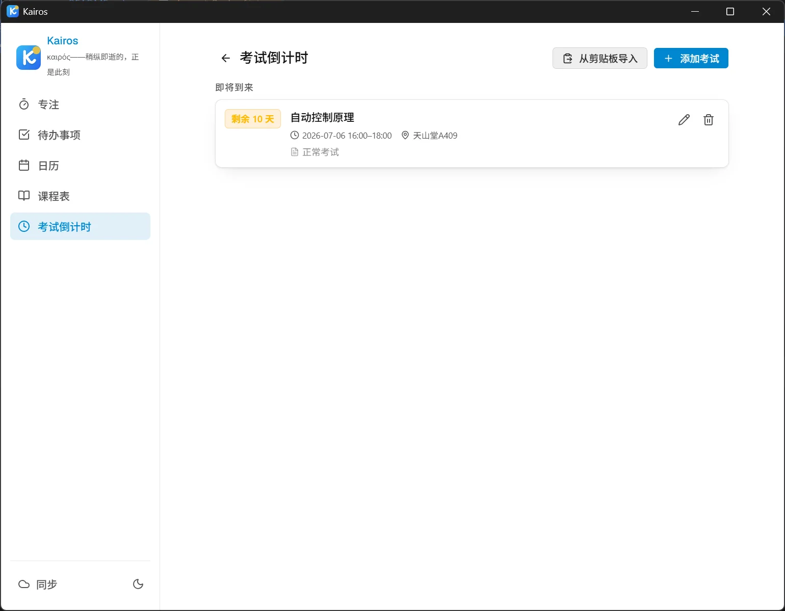

# Kairos

> καιρός——稍纵即逝的，正是此刻

Kairos 是一个面向学生的学业时间管理应用。它把专注计时、待办事项、课程表、考试倒计时和集成日历放在同一个工作台里，帮助用户在合适的时间看到该处理的安排，并进入执行状态。应用以纯 Web 形式部署，浏览器访问即可使用。

## 功能概览

| 模块 | 说明 |
|------|------|
| 专注 | 可配置的工作/休息计时器，支持圆环进度和阶段切换 |
| 待办事项 | 支持优先级、状态、截止日期、标签、筛选和排序 |
| 集成日历 | 同时展示课程、考试和有截止日期的待办；默认日视图，支持课程表式周视图 |
| 课程表 | 周视图课程网格，支持周次规则、学期起始日和课程导入 |
| 考试倒计时 | 管理考试时间、地点和备注，显示考试剩余时间 |
| Kairos | 更多功能入口，集中放置课程表、考试、同步和外观设置 |
| WebDAV 同步 | 通过用户自有 WebDAV 服务同步数据 |
| 邮件提醒 | 通过 SMTP 发送日程与晨报通知 |

## 界面预览

<table>
  <tr>
    <td></td>
    <td></td>
  </tr>
  <tr>
    <td></td>
    <td></td>
  </tr>
  <tr>
    <td colspan="2"></td>
  </tr>
</table>

## 核心特点

- 纯 Web：浏览器访问，无需安装桌面或移动客户端。
- 服务端存储：数据保存在 PostgreSQL 中，由单账号访问，不再依赖本机 SQLite。
- 学生场景优先：课程周次、单双周、考试倒计时、假期周日程和课表导入是一等能力。
- 计划与执行闭环：日历负责汇总安排，专注计时负责进入执行。
- 离线友好：前端不使用外部 CDN、字体服务、分析或遥测。
- 自托管：docker compose 一键部署，域名、TLS 证书与各项凭据由用户自行提供。

## 技术栈

| 层级 | 技术 |
|------|------|
| 应用壳 | 纯 Web |
| 前端 | React 19、TypeScript、Tailwind CSS v4、shadcn/ui、Fluent UI |
| 图标 | Lucide React |
| 后端 | Go 1.25（chi + pgx/sqlc） |
| 数据库 | PostgreSQL 16 |
| 同步 | WebDAV |
| 通知 | SMTP 邮件 |

## 开发环境

### 基础要求

- Go 1.25
- Node.js 18+
- Docker（用于本地开发数据库与生产部署）

### 安装与启动

```bash
npm install
make dev
```

`make dev` 会先启动一个临时 PostgreSQL 容器（`kairos-pg`，`localhost:5432`），再同时运行 Go API（默认 `:8080`）和 Vite 开发服务器。数据库容器在退出后需要手动清理：

```bash
make db-stop
```

只启动后端时：

```bash
make db-dev
make go-dev
```

## 常用命令

```bash
make dev        # 临时 PostgreSQL 容器 + Go API + Vite
make build      # 构建 Go API 二进制与前端 dist
make check      # Go vet + TypeScript 类型检查
make test       # 运行后端测试
make lint       # gofumpt / golangci-lint + 前端 lint
make audit      # 离线资源检查
make verify     # 完整检查流水线（check + lint + test + audit）
make clean      # 清理构建产物
```

前端资源单独构建：

```bash
npm run build
```

## 架构说明

```text
浏览器
  │  HTTPS
  ▼
nginx（TLS 终止 / 静态托管 / /api 反代）
  │  HTTP
  ▼
Go API（chi + JWT）
  ├─▶ PostgreSQL 16（业务数据）
  ├─▶ SMTP（邮件通知）
  └─▶ WebDAV（用户自有服务，数据同步）
```

业务规则位于 `server/`，前端负责渲染与交互，通过 `/api` 访问后端；生产环境由 nginx 统一终止 TLS 并托管前端产物。

## 部署

部署为单机 docker compose：PostgreSQL + Go API + nginx。请先在服务器上安装 Docker 与 Docker Compose。

1. 准备环境变量：

   ```bash
   cp .env.example .env
   ```

   编辑 `.env`，至少填写数据库密码、`JWT_SECRET`（≥32 字节）、登录账号 `APP_USER`、`APP_PASSWORD_HASH`，以及可选的 SMTP 配置。`DATABASE_URL` 中的主机名为 compose 服务名 `db`。

2. 生成账号密码哈希：

   ```bash
   make gen-password PASSWORD=你的密码
   ```

   将输出的 bcrypt 哈希填入 `.env` 的 `APP_PASSWORD_HASH`。

3. 放置 TLS 证书：把证书文件放到 `deploy/certs/`，命名为 `fullchain.pem` 与 `privkey.pem`。服务器、域名与证书由用户自行准备。

4. 启动：

   ```bash
   docker compose up -d
   ```

   或使用 `make up`。查看状态与日志：

   ```bash
   make ps
   make logs
   ```

所有敏感配置（数据库、JWT secret、账号、SMTP）都通过 `.env` 注入，不写入代码或镜像；`.env` 与证书目录均不纳入版本控制。

## 目录结构

```text
src/                         # React 前端
  components/                # 功能组件
    calendar/                # 集成日历
    kairos/                  # Kairos 功能入口
    pomodoro/                # 专注计时
    todo/                    # 待办事项
    courses/                 # 课程表
    exams/                   # 考试倒计时
    sync/                    # WebDAV 同步
    shared/                  # 共享布局与视觉组件
    ui/                      # shadcn/ui 基础组件
  types/                     # 前端类型定义
  hooks/                     # React hooks
  lib/                       # 工具函数

server/                      # Go API 后端
  cmd/api/                   # 服务入口
  cmd/genpassword/           # 密码哈希生成工具
  internal/                  # 配置、HTTP、业务与存储
  db/                        # SQL 迁移与 sqlc 查询

deploy/                      # 部署资源
  nginx.conf                 # TLS + SPA + /api 反代
  certs/                     # 用户放置 fullchain.pem / privkey.pem

compose.yaml                 # PostgreSQL + API + Web 编排
.env.example                 # 环境变量模板
```

## 设计方向

- 主色采用清澈蓝色系，减少原有紫色带来的拥挤感。
- 桌面端保留完整侧边栏入口。
- 窄屏下底部保留四个主入口：专注、待办、日历、Kairos。
- Kairos 页面承担品牌说明、次级功能入口、同步和外观设置。

## 许可

MIT
